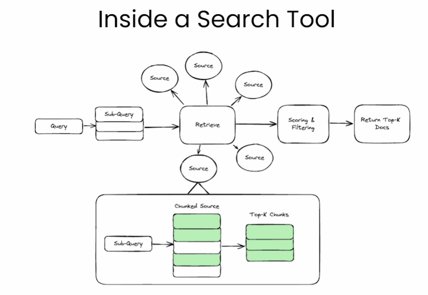
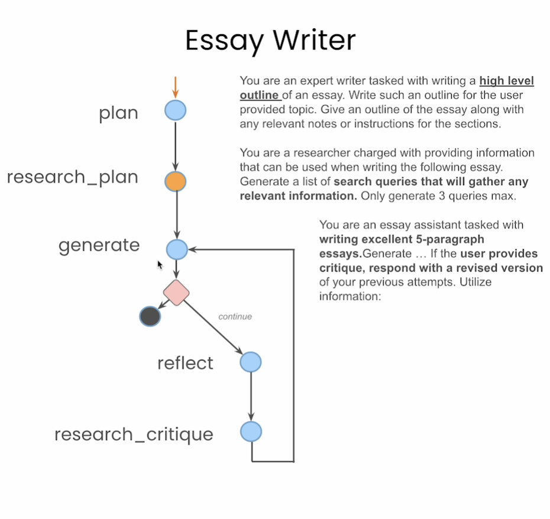

# AI Agents in LangGraph

Calvin Wetzel

## Build an Agent from Scratch

- **Agent class**
- **Prompt Template**
  - Provide Prompts and Observations
    - Model returns Thoughts/answers

## LangGraph Components

- **Prompt Templates** allow reusable prompts with formatted variables; formatted variables can come from user content
- **LangGraph** helps orchestrate control flow and cyclic graphs
  - ensures persistence (memory of conversation)
- **Graphs**
  - Nodes -> agents or functions
  - Edges -> connect nodes
  - Conditional Edges -> decisions
- **Agent State** is accessible to all parts of the graph
  - can be stored in persistence layer
  

- [Tavily](https://docs.tavily.com/docs/tavily-api/introduction) used for searching, scraping, and filtering and extracting the most relevant information from **online sources** in a single API call

## Persistence and Streaming

- `checkpointer`
- `thread` config used for production applications where you have many users
  - `thread_id`
- `async` -> want to be able to stream messages and all of the tokens that came before

## Human in the Loop

- `interrrupt_before`
- **State Memory**: snap shot of each state is stored in memory as graph is executing
  - Agent State, tread, thread_ts
  - `get_state(thread)`
- You can update/change a previous state by changing the query message that was passed to the tool call of that state
  - To get the output of this change, call `update_state`
  - Each time a state is modified, a new state is actually created and becomes the modified; allows you to visit previous states (state time travel)
  
## Essay Writer

### Outline

- Plan Node
- Research Plan Node
- Generate Essay
- Then, either finish if good or continue to reflect node
- If moved to reflect node, move to research critique node then generate another set of documents and append to current set of documents

## LangChain Resources

- [LangChain Documentation](https://python.langchain.com/v0.2/docs/introduction/)
- **LangServe** turns LangChain agent/model into a web server
- **LangSmith** helps with debugging, monitoring, and production

- **Architecture Types**
  - **Multi-Agent**: shared state; all agents work on same state and can iterate on that state
  - **Superviser**: supervisor calls to agents; each agent has its own state; supervisor routes and coordinates agents
  - **Flow Engineering**: pipeline with some nodes having loops; you must determine the proper flow for your agent
  - **Plan and Execute**: plan and then tasks for your agent; it completes a task and comes back to check if good and can proceed to the next task; does so until plan is complete
- LangChain enables controlability and flow control of these architectures!
